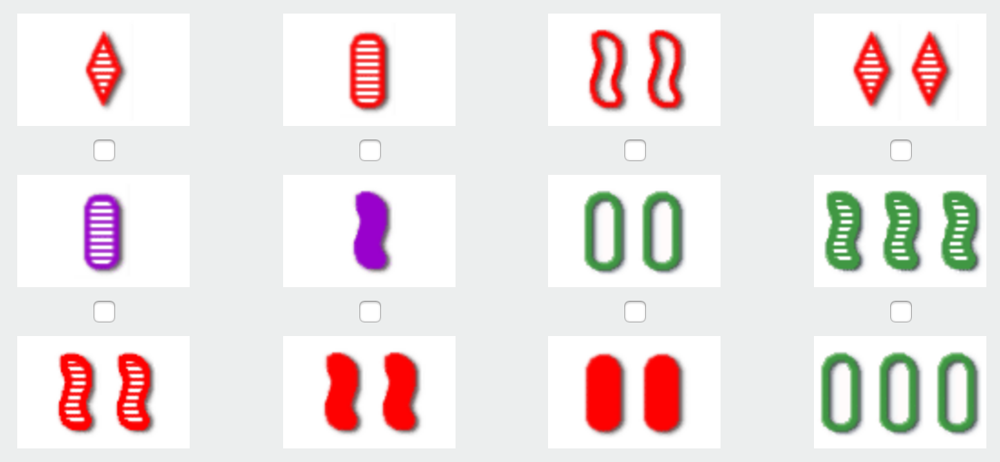

# Set Solver

```console
➜ python3 set_solver.py -h
usage: set_solver.py [-h] [-c CARDS] [-a AMOUNT]

Find indices of the sets in the game of Set.

optional arguments:
  -h, --help            show this help message and exit
  -c CARDS, --cards CARDS
                        Comma and space delimited string, for example "red 2
                        squiggle outline cold, red 2 diamond stripe warm, red
                        2 oval solid hot" or "0 0, 1 1"
  -a AMOUNT, --amount AMOUNT
                        Amount of cards in a set; default is 3
➜ python3 set_solver.py --cards 'red 1 diamond stripe, red 1 oval stripe, red 2 squiggle outline, red 2 diamond stripe, purple 1 oval stripe, purple 1 squiggle solid, green 2 oval outline, green 3 squiggle stripe, red 2 squiggle stripe, red 2 squiggle solid, red 2 oval solid, green 3 oval outline'
cards= [(0, 0, 0, 0), (0, 0, 1, 0), (0, 1, 2, 1), (0, 1, 0, 0), (1, 0, 1, 0), (1, 0, 2, 2), (2, 1, 1, 1), (2, 2, 2, 0), (0, 1, 2, 0), (0, 1, 2, 2), (0, 1, 1, 2), (2, 2, 1, 1)]
sets_by_index= [[2, 3, 10], [2, 5, 7], [2, 8, 9], [3, 4, 7], [3, 5, 11], [4, 10, 11]]
```

